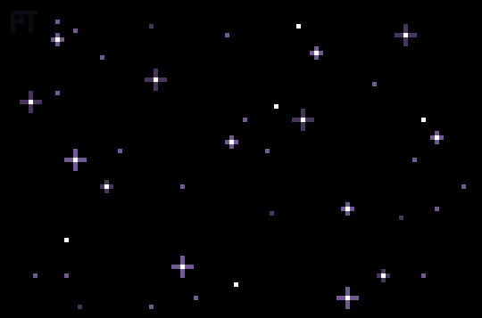
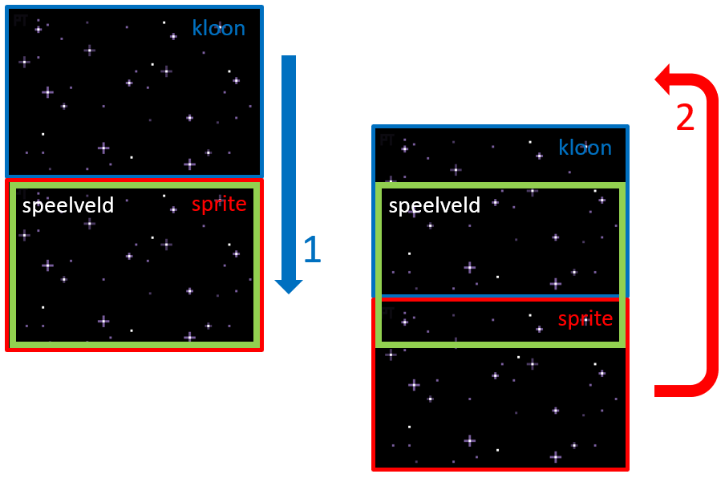

Je gaat met Scratch een "space shooter" bouwen.

<!--more-->

## Benodigdheden

Deze opdrachten maak je met [Scratch](https://scratch.mit.edu/). Als je nog geen account had, maak dit dan eerst aan.

Zet in Scratch eerst de taal op Nederlands via de wereldbol linksboven.

## Inleiding

In deze opdracht ga je een "space shooter" spel bouwen, waarbij je een ruimteschip bestuurt dat meteorieten kapot moet schieten of ontwijken. Het spel is gebaseerd op [dit project](https://www.youtube.com/watch?v=Mcc4LpbfOVM).

Dit zijn de stappen die je gaat programmeren:

1. Laat een ruimteschip bewegen met de pijltjestoetsen
2. Maak een bewegende achtergrond waardoor het lijkt alsof je door de ruimte vliegt
3. Laat meteorieten verschijnen en naar het ruimteschip vliegen
4. Zorg dat het ruimteschip op de meteorieten kan schieten

Als je hierna nog zin (en tijd) hebt dan zijn er nog allerlei uitbreidingen mogelijk, denk bijvoorbeeld aan het spel steeds iets moeilijker maken of geluid en andere *special effects* toevoegen.

## Laat een ruimteschip bewegen met de pijltjestoetsen

Eerst moet je een sprite hebben voor je ruimteschip. Je kunt dit natuurlijk zelf ontwerpen, maar ook een bestaande sprite kiezen (bijvoorbeeld het *Rocketship*). Noem deze sprite *ruimteschip*.

Zorg er eerst voor dat de sprite niet te groot is ten opzichte van het speelveld. Je kunt dit doen door het blok *maak grootte* te gebruiken dat je vindt in het menu *Uiterlijken*. Speel een beetje met het percentage om de goede grootte te vinden. Zorg ook dat het ruimteschip in het midden onderaan begint door het op x = 0 te plaatsen (x loopt van links naar rechts) en y zo in te stellen dat het nog net in beeld is. Je programma zou er nu ongeveer zo uit moeten zien:


      wanneer groene vlag wordt aangeklikt
      maak grootte (25) %
      ga naar x: (0) y: (-150)


De beweging van het ruimteschip kun je op verschillende manieren programmeren. Je kunt bijvoorbeeld iedere keer bij het indrukken van *pijltje links* de sprite een stukje laten opschuiven. Bij dit spel gaat het iets anders: als je op een pijltjestoets drukt dan geef je het ruimteschip een bepaalde snelheid, die vervolgens weer naar 0 (dus stilstaan) gaat. Op deze manier zal het ruimteschip een mooie vloeiende beweging maken. Neem de volgende stappen:

- Maak een **variabele** *x-snelheid* aan (in het menu Variabelen).
- Zet deze snelheid aan het begin van het spel op 0.
- Verander de snelheid naar een getal groter dan 0 als *pijltje rechts* wordt ingedrukt, en kleiner dan 0 voor *pijltje links*.
- Verander vervolgens de (x-)positie van het ruimteschip met de waarde van de variabele *x-snelheid*.
- Laat de snelheid steeds iets verder afnemen tot deze uiteindelijk weer 0 is.

**Tip 1**: de laatste drie stappen in de lijst hierboven moet je in een *herhaal* blok zetten.

**Tip 2**: je kunt de snelheid bijvoorbeeld laten afnemen door er een getal van af te trekken. Een andere manier is om de waarde te vermenigvuldigen met een getal kleiner dan 1.



      wanneer groene vlag wordt aangeklikt
      maak grootte (25) %
      ga naar x: (0) y: (-150)
      maak [snelheid_x] (0)
      herhaal
      als &lt;toets [pijltje links v] ingedrukt?&gt; dan
      maak [snelheid_x] (5)
      end
      als &lt;toets [pijltje rechts v] ingedrukt?&gt; dan
      maak [snelheid_x] (-5)
      end
      verander x met: (snelheid_x)
      maak [snelheid_x] ((snelheid_x) * (0.9))
      end



## Maak een bewegende achtergrond

Sla dit plaatje voor de achtergrond van het spel op je computer op:

Maak door de volgende stappen te volgen een *sprite* van dit plaatje:

1. Klik op het icoon voor een nieuwe sprite (rechtsonder, plaatje van de kat) en kies voor *Upload sprite*.
2. Upload het ruimte-plaatje.
3. Ga naar het tabblad *Uiterlijken* (linksboven, rechts naast het *Code* tabblad).
4. Maak in de editor het plaatje net zo groot als het hele speelveld door het op te rekken.

Plaats de ruimte-achtergrond aan het begin van het spel in het midden van het speelveld. **Vraag**: wat zijn *x* en *y* dan?



      wanneer groene vlag wordt aangeklikt
      ga naar x: (0) y: (0)



Nu ga je de achtergrond laten bewegen zodat het net is of je schip door de ruimte vliegt. **Vraag**: als je wil dat je schip vooruit vliegt, welke kant moet de achtergrond dan op gaan?

Net als bij de snelheid van je ruimteschip moet je hier een *variabele maken*, nu voor de "scroll" snelheid van de ruimte. Vervolgens verander je steeds de positie van de achtergrond met de snelheid die je hebt ingesteld. **Vraag**: moet je nu de *x* of de *y* veranderen? En moet *x* of *y* steeds groter worden? Of juist kleiner?



      wanneer groene vlag wordt aangeklikt
      ga naar x: (0) y: (0)
      maak [snelheid_scrollen] (4)
      herhaal
      verander y met ((snelheid_scrollen) * (-1))
      end



Als je nu het programma start, dan zie je dat er twee dingen fout gaan:

- je achtergrond verdwijnt uit beeld en komt niet meer terug
- er verschijnt een steeds groter wit vlak!

Een manier om deze twee problemen op te lossen staat beschreven in deze afbeelding:

Wat je ziet is dat je voor deze manier twee achtergronden gebruikt: de sprite, en een *kloon* van de sprite. De blauwe pijl (1) geeft aan dat de sprite en kloon allebei naar beneden schuiven. De rode pijl (2) laat zien dat zodra een achtergrond *beneden uit beeld* is verdwenen, je deze moet verplaatsen naar *boven* het speelveld. Op deze manier zorg je ervoor dat je geen wit vlak meer zult zien! Je moet nu dus een stuk code schrijven dat **als de sprite uit beeld is, deze weer naar boven verplaatst**. En je moet deze code niet alleen voor de sprite zelf, maar **ook voor de kloon van de sprite schrijven**.

**Tip 1**: dit is best een lastig stuk code, probeer het daarom eerst eens alleen voor de sprite, en daarna ook voor de kloon.

**Tip 2**: denk even goed na over de waarde die *y* heeft als de achtergrond boven en onder het speelveld is.



      wanneer groene vlag wordt aangeklikt
      ga naar x: (0) y: (0)
      maak een kloon van [mijzelf v]
      maak [snelheid_scrollen] (4)
      herhaal
      als &lt;(y-positie) > (-340)&gt; dan
      verander y met ((snelheid_scrollen) * (-1))
      anders
      ga naar x: (0) y: (345)
      end
      end

      wanneer ik als kloon start
      ga naar x: (0) y: (345)
      maak [snelheid_scrollen] (4)
      herhaal
      als &lt;(y-positie) > (-340)&gt; dan
      verander y met ((snelheid_scrollen) * (-1))
      anders
      ga naar x: (0) y: (345)
      end
      end




## Laat meteorieten verschijnen en naar het ruimteschip vliegen

Je hebt nu een ruimteschip dat door de ruimte vliegt en naar links en rechts kan bewegen. De hoogste tijd om de meteorieten te laten verschijnen! Dit ga je doen door steeds een nieuwe kloon van de "echte" sprite te maken.

Maak eerst een nieuwe sprite door een plaatje van een meteoriet in Scratch te laden, er zelf een te tekenen of een bestaande sprite te gebruiken (bijvoorbeeld een bal). Noem de sprite *meteoriet*.

Het belangrijkste wat deze sprite doet is het elke paar seconden (of zo snel als je wilt) maken van een kloon van zichzelf.



      wanneer groene vlag wordt aangeklikt
      herhaal
      wacht (4) sec.
      maak een kloon van (mijzelf v)
      end



Als je de sprite zelf niet ziet, dan komt dat omdat deze *achter* de bewegende achtergrond zit. Dat geeft niets want alleen de klonen moeten zichtbaar zijn, maar het is wat onhandig als je wil zien wat je code doet. Je kunt hiervoor het blok *ga naar laag voorgrond* toevoegen.

Ook als je de sprite en klonen wel ziet, gebeurt er nog vrij weinig. Dat komt omdat ze allemaal bovenop elkaar verschijnen. De volgende stap is dan ook om de klonen op allerlei plaatsen te laten verschijnen.

**Tip 1**: er is een speciaal *wanneer ik als kloon start* blok waar je deze code onder kunt zetten.

**Tip 2**: laat de meteorieten ergens bovenin verschijnen (dus zet *y* bijvoorbeeld op 180).

**Tip 3**: gebruik voor de *x* het blok *willekeurig getal tussen ...*.



      wanneer ik als kloon start
      ga naar laag [voorgrond v]
      ga naar x: (willekeurig getal tussen (-200) en (200)) y: (180)
      verschijn



Je bent er bijna! De een-na-laatste stap is om de klonen naar beneden te laten bewegen. Je kunt hiervoor weer een variabele voor de beweegsnelheid maken, een *herhaal* blok waarin je elke keer de plek van de sprite een beetje verandert werkt ook goed.

En waarom ben je nu nog niet helemaal klaar? Omdat het slim is je klonen ook weer te laten verdwijnen als ze onderaan het veld zijn aangekomen. Op deze manier blijft het spel soepel lopen.



      wanneer ik als kloon start
      ga naar laag [voorgrond v]
      ga naar x: (willekeurig getal tussen (-200) en (200)) y: (180)
      verschijn
      herhaal tot &lt; (y-positie) < (-180)&gt;
      verander y met (-2)
      end
      verwijder deze kloon



## Schieten op de meteorieten

Het is tijd om de meteorieten uit de weg te ruimen. Kies of maak een sprite die de kogel wordt, en noem deze ook *kogel*. Laat vervolgens een kogel "uit" het ruimteschip komen (bijvoorbeeld als je op de spatiebalk drukt) en naar het ruimteschip vliegen.

**Tip 1**: de code voor deze sprite lijkt wat op die voor de meteoriet; ook hier moet je klonen maken en die naar de meteorieten laten bewegen.

**Tip 2**: het blok *ga naar* is handig om de startplek van de kogel te bepalen.

**Tip 3**: als de kogel niets raakt is het wel slim de kloon te verwijderen als deze uit beeld verdwijnt.



      wanneer groene vlag wordt aangeklikt
      verdwijn
      herhaal
      als &lt;toets [spatiebalk v] ingedrukt?&gt; dan
      maak een kloon van (mijzelf v)
      end
      end

      wanneer ik als kloon start
      verschijn
      ga naar laag [voorgrond v]
      ga naar (ruimteschip v)
      herhaal tot &lt;raak ik (rand v)?&gt;
      verander y met (10)
      end
      verwijder deze kloon



## Winnen en verliezen

Natuurlijk wil je ook punten verdienen wanneer je een meteoriet raakt met je kogels, en bijvoorbeeld weer verliezen wanneer het ruimteschip door een meteoriet geraakt wordt. Maak voor de puntentelling een variabele *score* aan en zet die op 0 aan het begin van het spel (doe dit bij de code voor het ruimteschip).

Nu moeten we nog een paar stukken code toevoegen, namelijk:

- om op te merken wanneer een een meteoriet door een kogel geraakt wordt
- om hierna de meteoriet en de kogel te laten verdwijnen
- om op te merken wanneer een meteoriet het ruimteschip raakt

**Tip**: de meeste code hoort bij klonen van de meteoriet sprite.



      wanneer ik als kloon start
      herhaal
      als &lt; raak ik (kogel v)?&gt; dan
      verander [score v] met (1)
      verwijder deze kloon
      end





      wanneer ik als kloon start
      wacht tot &lt; raak ik (meteoriet v)?&gt;
      wacht (0.1) sec.
      verwijder deze kloon





      wanneer ik als kloon start
      herhaal
      als &lt; raak ik (ruimteschip v)?&gt; dan
      maak [score v] (0)
      verwijder deze kloon
      end



Dit was het, veel speelplezier!

## Uitbreidingen

Je kunt het spel natuurlijk nog veel mooier, spannender en moeilijker maken.
Hier heb je alvast een lijstje met ideeën als je nog verder wil programmeren:

- zorg dat je minder vaak kogels kunt afschieten
- laat de meteorieten niet alleen naar beneden komen maar ook echt op je ruimteschip af
- laat de meteorieten sneller bewegen als je meer punten hebt gehaald
- voeg geluiden en andere effecten toe


